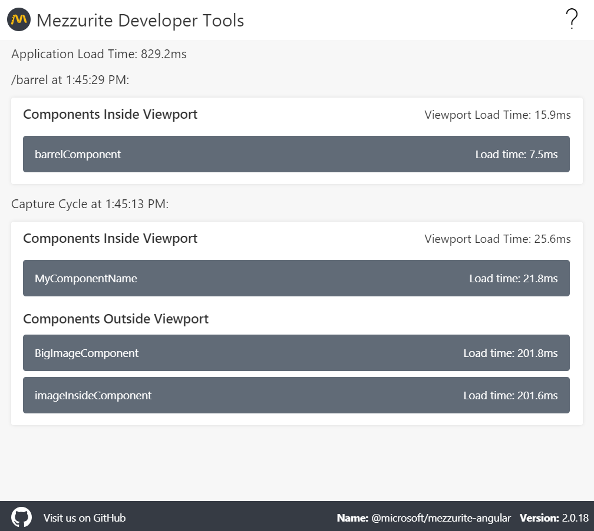

# Mezzurite Developer Tools

Mezzurite Developer Tools allow you to view Mezzurite metrics for any application being instrumented with [Mezzurite](https://github.com/Microsoft/Mezzurite "Mezzurite").

  

## Requirements
You need an [Angular](https://github.com/Microsoft/Mezzurite/blob/master/Mezzurite.Angular/README.md "Angular"), [AngularJS](https://github.com/Microsoft/Mezzurite/blob/master/Mezzurite.AngularJS/README.md "AngularJS"), or [React](https://github.com/Microsoft/Mezzurite/blob/master/Mezzurite.React/README.md "React") application running Mezzurite.

## Installation
To install, download the latest [release](https://github.com/Microsoft/Mezzurite-DevTools/releases "release"), or clone the repository and build the extension by running `npm run build:prod`.

Navigate to `chrome://extensions` and select `Load unpacked`, selecting the `/dist` folder output from the build.

## Mezzurite Ecosystem
| Projects                                                                                          |                                                                            |
| ------------------------------------------------------------------------------------------------- | -------------------------------------------------------------------------- |
| [ApplicationInsights-JS-Mezzurite](https://github.com/Microsoft/ApplicationInsights-JS-Mezzurite) | [Application insights](https://github.com/Microsoft/ApplicationInsights-JS) extension of Mezzurite                                |
| [Mezzurite](https://github.com/Microsoft/Mezzurite)                                               | Base SDK for Mezzurite with Angular, AngularJS and React integration       |
| [Mezzurite DevTools](https://github.com/Microsoft/Mezzurite-DevTools)                             | See Mezzurite metrics being captured with a browser extension              |
| [VSCode Mezzurite](https://github.com/Microsoft/vscode-mezzurite)                                 | Check which components and modules are instrumented within VS Code         |

## Contributions
[To read about contributing to this repo, click here](CONTRIBUTING.md)
